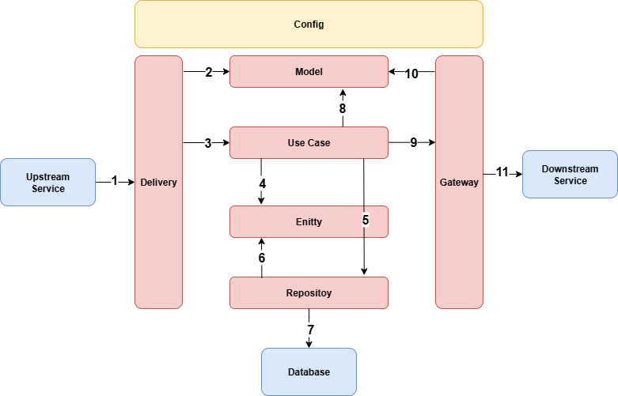
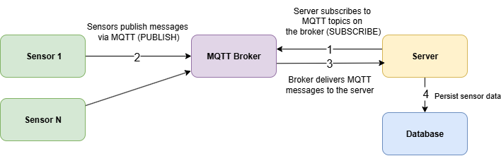

# IOT SENSOR

## Description

**iot-sensor** is a small utility that simulates IoT devices and **publishes sensor readings frequently** over the **MQTT** protocol. It is useful for local development, demos, and basic load testing of MQTT consumers.

## What it does

- Connects to an MQTT broker (for example Mosquitto on `localhost:1883`).
- Publishes JSON messages on a configurable topic at a fixed interval.
- Generates values within a configurable numeric range to mimic real sensors.

## Message format

Each message is a single JSON object:

```json
{
  "id1": "SENSOR-1",
  "id2": 1,
  "sensor_type": "temperature",
  "sensor_value": 51.5,
  "timestamp": "2025-08-26T19:21:10Z"
}
```

## Architecture



1. External system perform request (HTTP, Messaging (MQTT))
2. The Delivery creates various Model from request data
3. The Delivery calls Use Case, and execute it using Model data
4. The Use Case create Entity data for the business logic
5. The Use Case calls Repository, and execute it using Entity data
6. The Repository use Entity data to perform database operation
7. The Repository perform database operation to the database
8. The Use Case create various Model for Gateway or from Entity data
9. The Use Case calls Gateway, and execute it using Model data
10. The Gateway using Model data to construct request to external system
11. The Gateway perform request to external system (HTTP, Messaging (MQTT))

---  

## Data Flow




## Tech Stack

* Golang : [https://github.com/golang/go](https://github.com/golang/go)
* Mosquitto (MQTT Broker) : [https://github.com/eclipse-mosquitto/mosquitto](https://github.com/eclipse-mosquitto/mosquitto)

## Framework & Library

* Echo (HTTP Framework) – v4.13.4 : [https://github.com/labstack/echo](https://github.com/labstack/echo)
* Viper (Configuration) – v1.20.1 : [https://github.com/spf13/viper](https://github.com/spf13/viper)
* go-sql-driver/mysql (MySQL Driver) – v1.9.3 : [https://github.com/go-sql-driver/mysql](https://github.com/go-sql-driver/mysql)
* Eclipse Paho MQTT Go client (Messaging) – v1.5.0 : [https://github.com/eclipse-paho/paho.mqtt.golang](https://github.com/eclipse-paho/paho.mqtt.golang)
* Go Playground Validator (Validation) – v10.27.0 : [https://github.com/go-playground/validator](https://github.com/go-playground/validator)
* Logrus (Logger) – v1.9.3 : [https://github.com/sirupsen/logrus](https://github.com/sirupsen/logrus)

## Configuration

All example configuration is in `.env.example` file.

## API Spec

All API Spec is in `/api` folder.

## Postman Collection

Postman collection is in `/api/postman_collection` folder.

## Prerequisites

- Docker and Docker Compose
- Optional: Go 1.24 for local, non-Docker development

---  

## Quick Start (Docker)

1. Create .env file from .env.example
```  
cp .env.example .env  
```  

2. Run the app with docker (daemon mode):

```bash  
docker compose up -d
```  

- Follow logs:

```bash  
docker compose logs -f api
```  

3. Stop:

```bash  
docker compose down
```  

- Stop and clean up:

```bash  
docker compose down -v
```  
  
---

## Configuration (`.env`)

Create a `.env` file at the project root. The following variables are commonly used by the service and `docker-compose.yml`.  
Example are in `.env.example.` Adjust names and defaults to match your setup
  
---

## Simulate 100 Sensors (concurrent publishers)

Run the built-in simulator to publish MQTT messages from **100 virtual sensors** at the same time.

### Steps
```bash
go mod download
cp .env.simulation .env
go run ./cmd/simulation
````

---

## Local Development (without Docker)

```bash  
go mod download
cp .env.example .env   # if available
go run ./cmd/web
```
  
---  

## License

This repository is provided as-is. Add your license of choice (MIT, Apache-2.0, etc.).